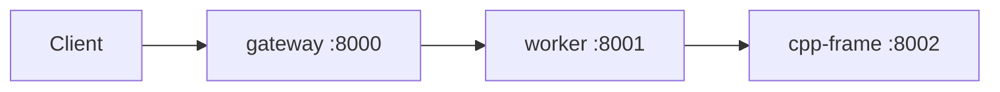

# cloud-microservices-v2

Junior-oriented **three-service** demo: a Python gateway and worker call a small **C++17** HTTP service that counts “bright” pixels using **two `std::thread`s** and a **`std::mutex`**. Python code uses **synchronous** FastAPI handlers and **`requests`** only (no asyncio for app logic).

## Architecture



- **gateway** — public entry; `POST /process` forwards `pixels` + `threshold` to the worker.
- **worker** — `POST /process` calls cpp-frame `POST /process_frame`.
- **cpp-frame** — counts pixels with `value >= threshold`; returns `bright_pixel_count`.

Each service exposes `GET /health` and `GET /metrics` (`request_count`, `error_count`).

## Prerequisites

- Docker and Docker Compose
- Python 3.11+ (for local unit tests)

## Run

```bash
cd /path/to/cloud-microservices-v2
docker compose up --build
```

End-to-end sample:

```bash
curl -s -X POST http://localhost:8000/process \
  -H 'Content-Type: application/json' \
  -d '{"pixels":[0.1,0.9,0.5],"threshold":0.5}'
```

Or from the repo root:

```bash
make demo
```

Compose uses **`restart: unless-stopped`** and **healthchecks**; `worker` waits for healthy `cpp-frame`, `gateway` waits for healthy `worker`.

## Test

```bash
pip install -r gateway/requirements.txt -r worker/requirements.txt -r requirements-dev.txt
make test
```

Tests mock HTTP with `unittest.mock` (no running containers required). FastAPI’s `TestClient` pulls in **`httpx`** as a dev-only dependency (see `requirements-dev.txt`); services still call each other with **`requests`** only.

## What I learned

_Use this section in your own words for interviews: why threads + mutex here, why 502 on downstream failure, how Docker DNS resolves `worker` and `cpp-frame`, and one thing you would improve next._

## Related

Inspired by the idea of [cloud-microservices](https://github.com/IegorKovalov/cloud-microservices), rebuilt smaller for understanding—this repo does **not** copy its code or layout.
